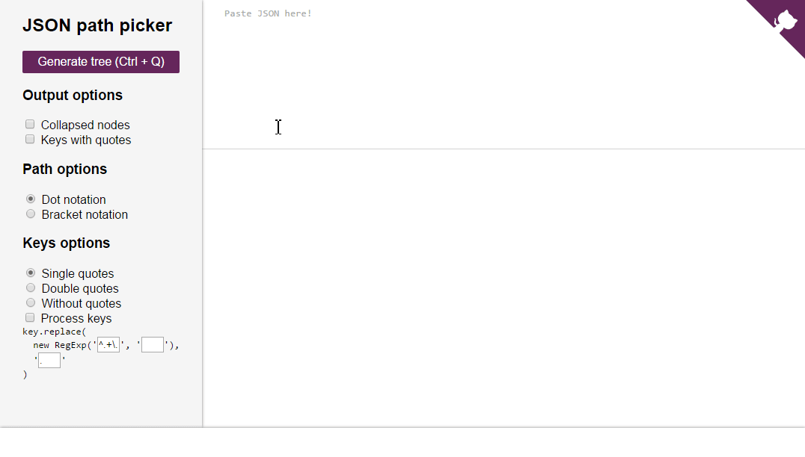

# [JSON path picker](https://piotros.github.io/json-path-picker/)

**JSON path picker** is an [online tool](https://piotros.github.io/json-path-picker/) that allows to transform JSON strings into HTML representations.
The main difference to other JSON viewers is that **JSON path picker** allows to find a path to the key by clicking an icon near to the key name. 
This simplifies process of creating [JSONPaths](http://goessner.net/articles/JsonPath/) based on mocked responses.
 

 
JSON path picker can be also used in your app. Core features are packed as jQuery plugin. Read more about [plugin installation](#plugin-installation), [usage](#plugin-usage) and [options](#plugin-options).

## Features

- Syntax highlighting
- Collapsible and expandable child nodes
- Clickable links
- Easily readable and minimal DOM structure
- Path picking
  * Two path notations
  * Three quote styles
  * Key processing possibility (using `RegExp`)

## Plugin Installation

Import `json-path-picker.js` and `json-path-picker.css` in your application.

## Plugin Usage

1. Create `pre` element for rendered tree output:
```html
<pre id="json-renderer"></pre>
```

2. Create path target element:
```html
<input id="path" type="text">
```

3. Call the `jsonPathPicker()` method and pass your JSON data and path target element selector (or jQuery object) as an arguments:
```js
var data = {
  "foobar": "foobaz"
};

$('#json-renderer').jsonPathPicker(data, '#path');
```

## Plugin Options

The `jsonPathPicker` method accepts an optional `options` object as a third argument.

| Option                     | Type      | Default         | Description                                              |
|----------------------------|-----------|-----------------|----------------------------------------------------------|
| outputCollapsed            | boolean   | `false`         | All nodes are collapsed.                                 |
| outputWithQuotes           | boolean   | `false`         | All keys in output HTML are surrounded with double quotation marks. Eg. `{"foobar": 1}` instead of `{foobar: 1}`.                                                             |
| pathNotation               | string    | `'dots'`        | Path notation type. Accepts `dots` for dots notation (eg. `example.in.dots.notation`) and `brackets` for brackets notation (eg. `['example']['in']['brackets']['notation']`). |
| pathQuotesType             | string    | `'single'`      |  |
| processKeys                | boolean   | `false`         |  |
| keyReplaceRegexPattern     | string    | `undefined`     |  |
| keyReplaceRegexFlags       | string    | `undefined`     |  |
| keyReplacementText         | string    | `''`            |  |


Example:

```js
$('#json-renderer').jsonPathPicker(data, '#path', {
    outputWithQuotes: true,
    pathNotation: 'brackets',
    pathQuotesType: 'double'
});
```
## Contributing
Feel free to post feature requests, create pull requests or report bugs.

## Credits
**JSON path picker** is based on [jQuery json-viewer](https://github.com/abodelot/jquery.json-viewer) plugin.
Big thanks to [Alexandre Bodelot](https://github.com/abodelot) for creating an awesome project!

